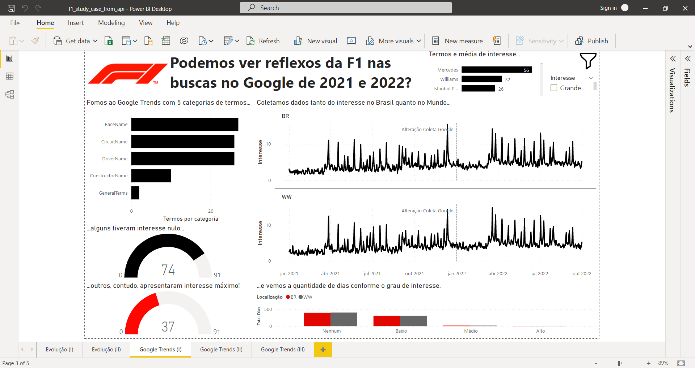

# Formula 1 Marketing Campaign

The objective of this project was to create a dashboard where we could see how Formula 1 has changed after its creation and its effect on marketing. More than this, the dashboard analyzed the data from Google Trends related to Formula 1 in 2021 and 2022.

For this project, the main products were written in Portuguese (Power BI dashboard and presentation about technical and analytical aspects) and are available in this repository.

# Methodology

Data about Formula 1 was collected by connecting Power Query with the [Ergast Developer API](http://ergast.com/mrd/) and exported as a Microsoft Excel spreadsheet.

Data about [Google Trends](https://trends.google.com/trends/) was collected with [pytrends](https://pypi.org/project/pytrends/) and exported as a CSV file. This task was done with a [notebook](data/f1_google_trends.ipynb) available in ` data folder`. There is more information about the terms in the notebook. In short words, we look for racer names, circuit names, driver names, constructor names, and some general terms (Formula 1 and F1).

# Results

We could understand some changes in Formula 1 championship and their impact on possible marketing campaigns and contracts. Moreover, it was possible to correlate the racers with the interesting measured with Google Trends, one critical marketing thermometer. In the dashboard’s first version, this relation was made by some DAX formulas. However, we calculated the interest in the terms on each racer day.

[See this dashboard here...](https://app.powerbi.com/view?r=eyJrIjoiNjY1ZTQyNzMtNTExZi00ZmMxLTkzNzktNGYwOTMwYjA1MGY0IiwidCI6ImI4N2IxYmQyLTc5YTItNGY4ZS1hYTljLWYxMDQ2MTVlOGI0NiJ9)

# Potencial applications

This solution API/Power Query + pytrends/Python/Power Query + Power BI is an excellent recipe for creating structures to collect, process, and present data. The only restriction is how many terms will be monitored. Considering Google restrictions, a significant number of words should be prohibitive.

# Future works and improvements

The data collection process in this project is semi-automatic, considering that you need to activate the functions. However, this can easily upgrade to an automatic way. Instead of using Power Query + Microsoft Excel, we can ingest data directly in Power BI. The same strategy can be accomplished with Python. We can set up Power BI to call and run scripts in an environment configurated explicitly with the required libraries.

We can configure an incremental update for the two data sources. This may reduce the data traffic, but it will increase data storage.

In terms of analytical improvements, we can apply some time-series analysis to understand better if the interesting trend is up or down, for example. We can also collect more data and improve the relationship between terms and other fields in the F1 base data. For example, we can click on a specific race and the words could be filtered.

# Contact

You can contact me by [mail](gregoryomelo@gmail.com) or [LinkedIn]( https://www.linkedin.com/in/gregory-melo-72ab5bb0/)!
